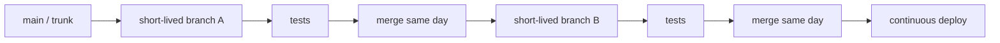

# 06. Trunk-Based Development


## Mục Tiêu

Hiểu cách team merge thay đổi nhỏ, thường xuyên vào trunk, thường là `main`.

## Mô Hình



## Ý Tưởng Chính

Trunk-Based Development giảm branch drift bằng cách merge sớm và thường xuyên. Nó hoạt động tốt khi team có test tự động, CI nhanh, và biết chia task thật nhỏ.

## Hệ Thống Lab Đã Chuẩn Bị

Folder này có một project Node.js nhỏ để bạn test workflow thật:

```text
06-trunk-based-development/
├── .github/
│   └── workflows/
│       └── ci.yml
├── src/
│   ├── featureFlags.js
│   ├── index.js
│   └── taskBoard.js
├── tests/
│   ├── featureFlags.test.js
│   └── taskBoard.test.js
├── package.json
└── README.md
```

Trong đó:

- `src/` chứa code ứng dụng.
- `tests/` chứa test tự động.
- `package.json` chứa script chạy app, build, test, và CI local.
- `.github/workflows/ci.yml` là pipeline CI mẫu cho GitHub Actions.

## Chạy Thử Local

Đi vào folder lab:

```bash
cd 06-trunk-based-development
```

Chạy app:

```bash
npm start
```

Chạy test tự động:

```bash
npm test
```

Chạy giống CI:

```bash
npm run ci
```

Script `npm run ci` sẽ chạy:

```text
npm run build && npm test
```

Điều này mô phỏng rule trong team thật:

```text
Không pass build + test thì không merge vào main.
```

## Test Tự Động Và CI Nằm Ở Đâu?

Test tự động nằm trong repo:

```text
tests/featureFlags.test.js
tests/taskBoard.test.js
```

CI là hệ thống chạy các test đó tự động. Trong lab này, CI được mô tả tại:

```text
.github/workflows/ci.yml
```

Khi đưa project này lên GitHub, GitHub Actions sẽ chạy CI khi:

- Có Pull Request vào `main`.
- Có push trực tiếp vào `main`.

## Bài Lab

1. Khởi tạo Git repo trong folder này.
2. Tạo commit đầu tiên trên `main`.
3. Tạo branch `task/update-title`.
4. Commit một thay đổi rất nhỏ.
5. Merge ngay về `main`.
6. Tạo branch `task/add-footer`.
7. Commit một thay đổi rất nhỏ.
8. Merge ngay về `main`.
9. Xem lịch sử bằng `git log --oneline --graph --all`.

## Bài Lab Với Code Thật

### 1. Khởi tạo repo

```bash
git init
git branch -M main
git add .
git commit -m "init trunk based development lab"
```

### 2. Chạy CI local trước khi tạo branch

```bash
npm run ci
```

### 3. Tạo branch nhỏ thứ nhất

```bash
git switch -c task/add-board-title
```

Sửa `src/index.js`, ví dụ đổi title hoặc thêm một task nhỏ.

Sau đó chạy:

```bash
npm run ci
git add .
git commit -m "add board title task"
git switch main
git merge task/add-board-title
```

### 4. Tạo branch nhỏ thứ hai

```bash
git switch -c task/add-test-case
```

Thêm một test nhỏ trong `tests/taskBoard.test.js`.

Sau đó chạy:

```bash
npm run ci
git add .
git commit -m "add task board test case"
git switch main
git merge task/add-test-case
```

### 5. Quan sát lịch sử

```bash
git log --oneline --graph --all
```

## Checklist Hiểu Bài

- Bạn hiểu branch trong workflow này nên sống ngắn.
- Bạn hiểu vì sao task cần nhỏ.
- Bạn hiểu vì sao CI/test tự động rất quan trọng.
- Bạn biết test nằm trong `tests/`, còn CI config nằm trong `.github/workflows/ci.yml`.
- Bạn biết chạy `npm run ci` trước khi merge branch nhỏ vào `main`.
